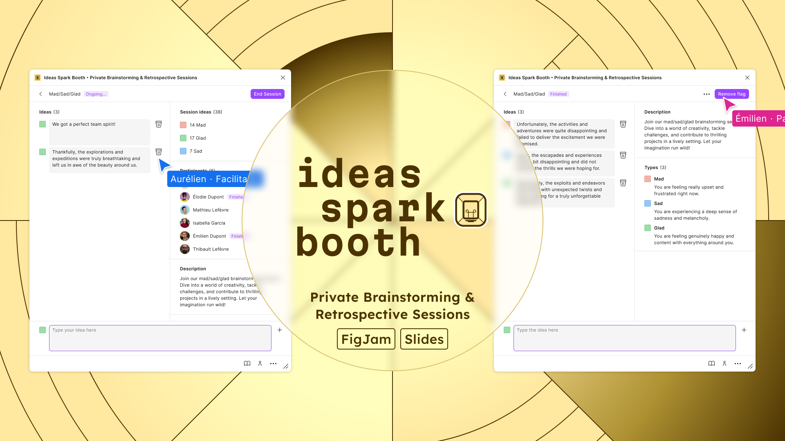

# Welcome aboard!

<figure><figcaption></figcaption></figure>

`Ideas Spark Booth` empowers your team with a powerful `FigJam` and `Slides` plugin for conducting focused brainstorming sessions with complete participant privacy. Drive collective innovation through engaging, purposeful activities designed to unlock your team's creative potential.

This plugin will allow you to:

* Create tailored engagement activities.
* Conduct and animate sessions.
* Share ideas privately.
* Review past sessions.

For a quick start, you can refer to these pages:


[create-an-activity](browse-activities/create-an-activity/)



[facilitate-a-session](run-sessions/facilitate-a-session/)



[participate-in-a-session](run-sessions/participate-in-a-session/)



[analyse-a-session.md](analyse-sessions/analyse-a-session.md)

