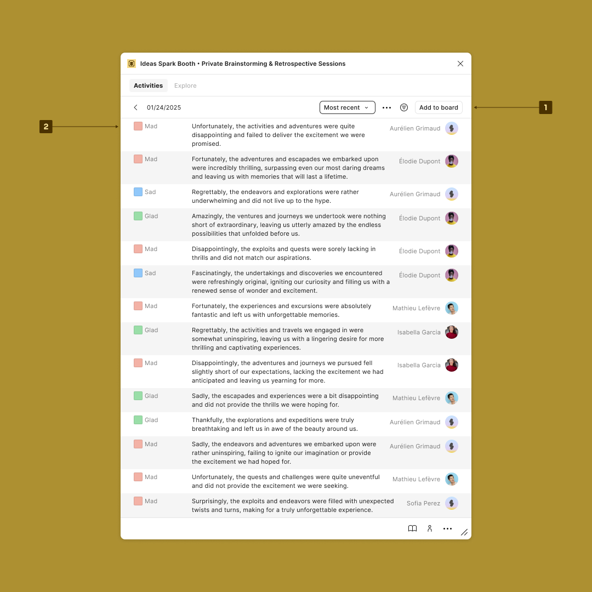

# Overview

<figure><figcaption>
History
</figcaption></figure>

1. Run the actions:
   * `Add to board` or `Add to slides`: Generate a classification of the ideas from the session directly on the document or the board.
   * Filter by types or participants.
   * Export the session to CSV.
   * Export the session to JSON to import it into another document.
   * Remove the session.
   * Sort the ideas.
2. Read each structured idea.
