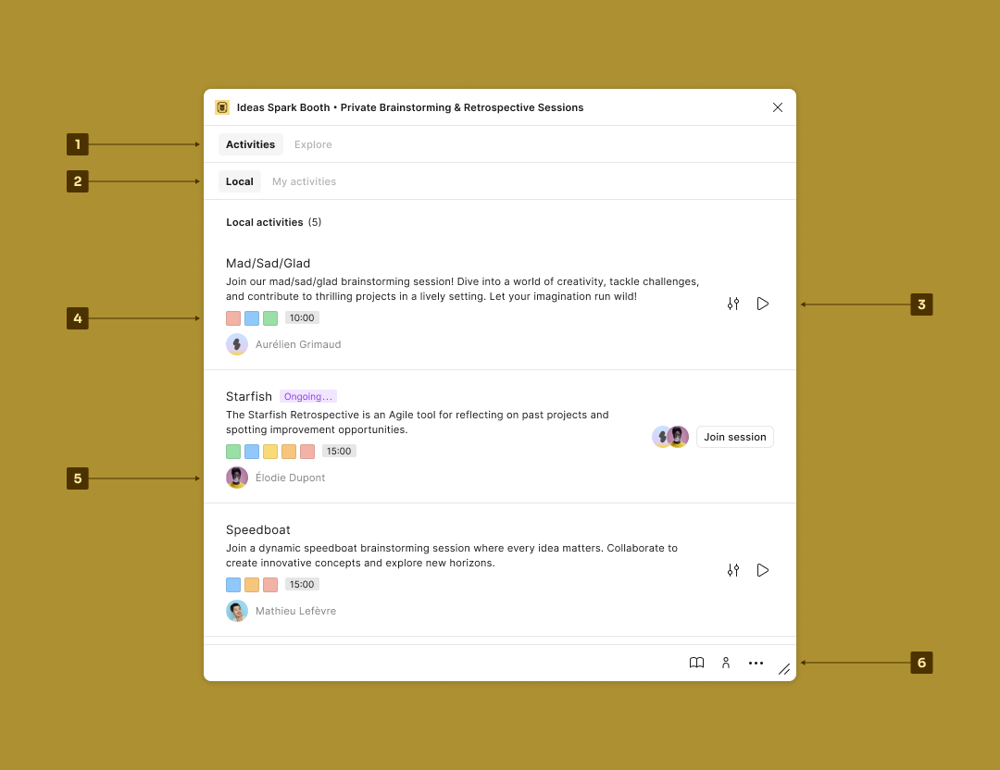
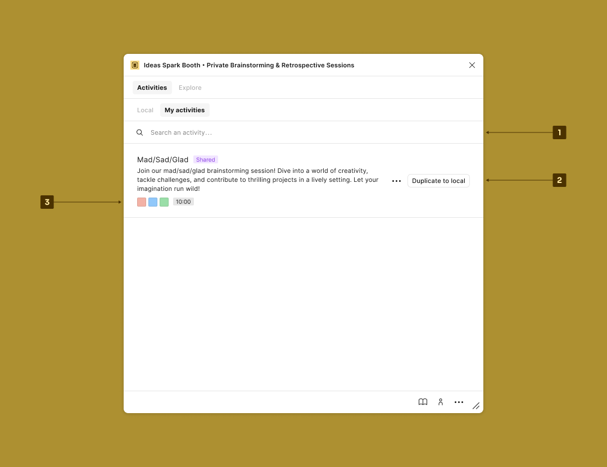
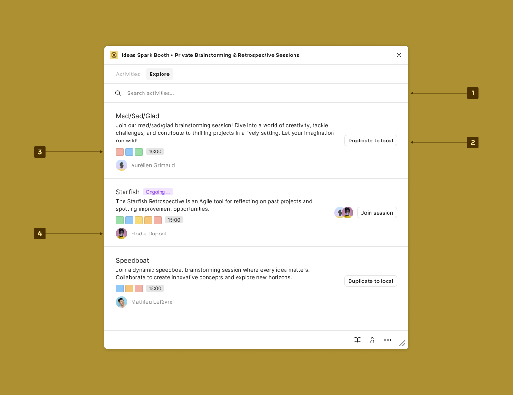
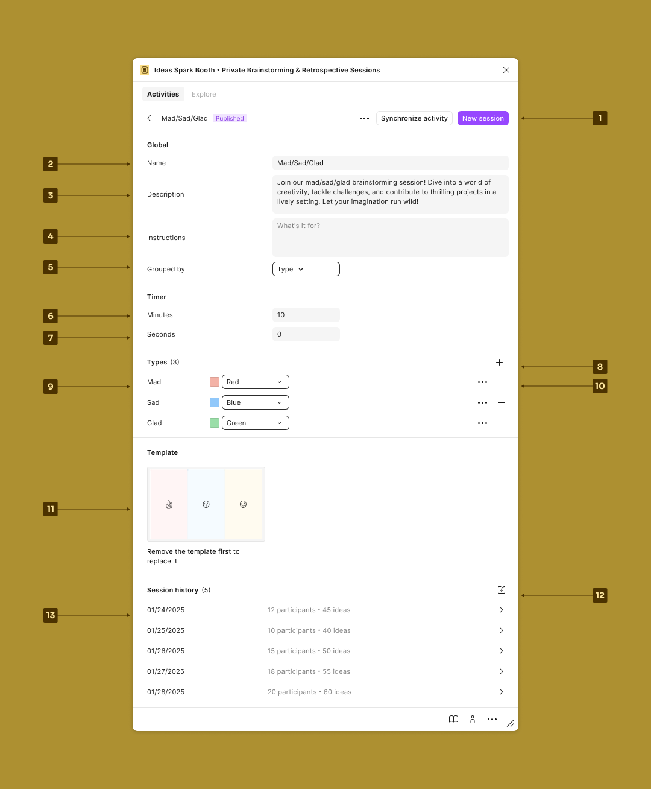

# Overview

<figure><figcaption>
Local activities
</figcaption></figure>

1. Browse the contexts:
   * `Activities`: List of the local and remote activities.
   * `Explore`: List of shared activities provided by the user community.
2. Browse the sub-contexts:
   * `Local`: List of the activities stored in the `FigJam` or `Slides` document.
   * `My activities`: List of your published activities.
3. Run the actions:
   * `Settings` button: Open the settings related to the activity.
   * `Play` button: Start a session.
4. List of the types followed by the activity duration.
5. Activity provider.
6. Access shortcuts:
   * Open the docs.
   * Open `User menu`.
   * Open `More menu`.

***

<figure><figcaption>
My activities
</figcaption></figure>

1. Search for an activity.
2. Duplicate an activity to the file or:
   * Unpublish the activity.
   * Share or stop sharing the activity with the community.
3. List of the types followed by the activity duration.

***

<figure><figcaption>
Explore
</figcaption></figure>

1. Search for an activity.
2. Duplicate an activity to the file or:
   * Unpublish the activity.
   * Share or stop sharing the activity with the community.
3. List of the types followed by the activity duration.
4. Activity provider.

***

<figure><figcaption></figcaption></figure>

1. Run the actions:
   * `New session`: Start a new session.
   * `Synchronize activity` or `Publish activity`: Manage the remote activity lifecycle.
   * `Ellipses` button:
     * `Add overview to slides`: Generate a summary of the activity on a `Slides` document.
     * `Add overview to board`: Generate a summary of the activity on a `FigJam` board.
     * `Add a report to slides`: Generate a summary followed by each session related to the activity on a `Slides` document.
     * Import sessions into the activity.
     * Export the activity (configuration, sessions, ideas) to use it in another document.
     * Delete the activity.
2. Change the activity `Name`.
3. Change the activity `Description`.
4. Change the activity `Instructions`.
5. Change the `Grouped by` option.
6. Change the `Minutes`.
7. Change the `Seconds`.
8. Add a `Type`.
9. Rename the type, change its color, and add a `Description`.
10. Remove a `Type`.
11. Import sessions into the activity.
12. Access a specific session from the history.
