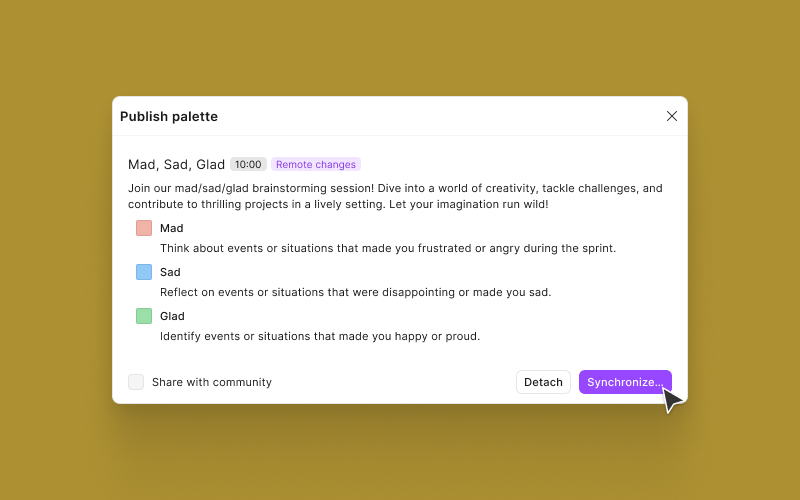

# Synchronize activities

If the activity is not yours, you can:

* `Synchronize`: Update it from the last version on the remote.

<figure><figcaption></figcaption></figure>

* `Revert`: Roll it back to the `Master`.

<figure><figcaption></figcaption></figure>

* `Detach`: Remove the link with the `Master` and make it local.

<figure><figcaption></figcaption></figure>
