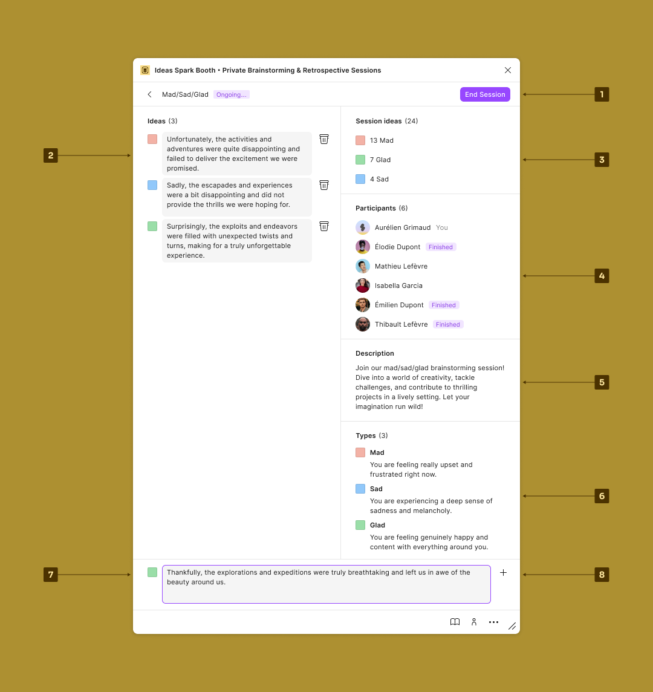
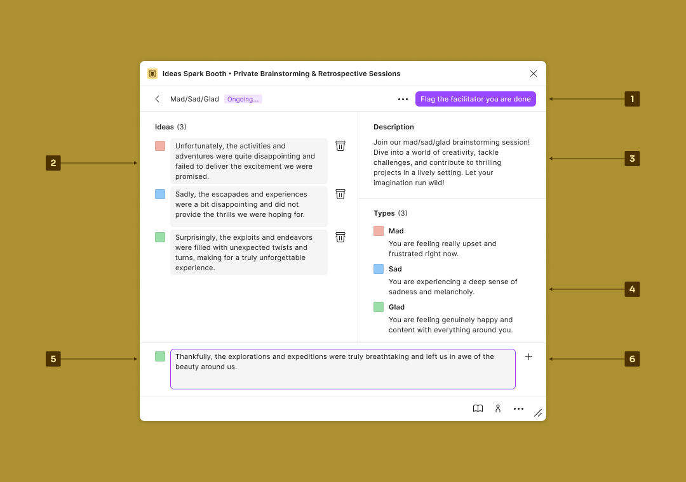

# Overview

<figure><figcaption>
Facilitator
</figcaption></figure>

1. `End session` and back to the local activities list.
2. Update the typed ideas:
   * Change the type.
   * Change the text.
   * Remove the idea.
3. Watch the `Session ideas` in real-time.
4. Watch the `Participants` in real-time.
5. Read the `Description` of the activity.
6. Read the `Types` of the activity.
7. Type an idea and set its type.
8. Add an idea.

***

<figure><figcaption>
Participant
</figcaption></figure>

1. `Flag facilitator you are done`, or `End session` and back to the local activities list.
2. Update the typed ideas:
   * Change the type.
   * Change the text.
   * Remove the idea.
3. Read the `Description` of the activity.
4. Read the `Types` of the activity.
5. Type an idea and set its type.
6. Add an idea.
